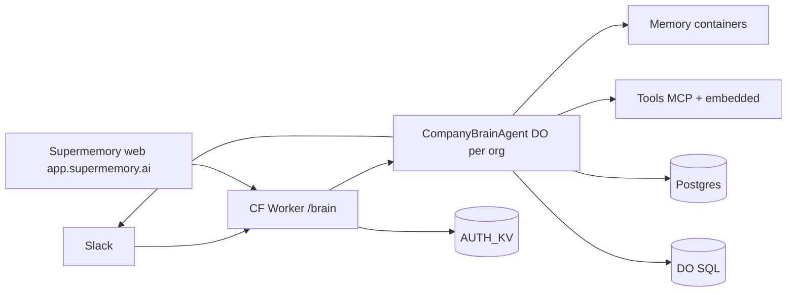

# Company Brain architecture

**Verified against:** code under `apps/api/src/lib/brain/**` (see anchors).  
**Details:** [slack.md](./slack.md), [agent.md](./agent.md).

## System map

```text
 Slack workspace                    Supermemory web · internal HTTP
 Events · OAuth · interactions         /brain/models, settings,
        │                              mcp-connections, research,
        │                              automations, …
        ▼
 ┌──────────────────────────────────────────────────────────┐
 │  Cloudflare Worker (Hono)                                 │
 │  features.companyBrain → route /brain/*                   │
 │  Slack: HMAC verify · AUTH_KV dedupe · resolve org        │
 └────────────────────────────┬─────────────────────────────┘
                              │ getAgentByName(COMPANY_BRAIN_AGENT, orgId)
                              ▼
 ┌──────────────────────────────────────────────────────────┐
 │  CompanyBrainAgent  (Agents SDK Durable Object)           │
 │  one instance per Supermemory orgId                       │
 │                                                           │
 │  owns: Slack turns · chime · rollout · team invite ·      │
 │        research · automations · observe · approvals ·     │
 │        leases · scheduled tasks · trial reminders         │
 └───┬───────────────┬───────────────────┬──────────────────┘
     │               │                   │
     ▼               ▼                   ▼
 Memory spaces    Tool runtime        Slack Web API
 (containers)     MCP / Google /      streams · Block Kit
                  sandbox / web       reactions · files
```



## Main path (Slack answer)

1. Admin installs Slack from an authenticated Supermemory org (`GET /brain/slack/oauth/install`).
2. Bot token is encrypted into `slack_workspace`; bootstrap creates/adopts `#company-brain`.
3. Slack posts signed events to `POST /brain/slack/events`.
4. Worker verifies signature, dedupes, resolves workspace → org, returns `{ok:true}`, dispatches with `waitUntil`.
5. DO classifies: explicit turn / chime / context-only / lifecycle (`team_join`, `user_change`, …).
6. Passive thread + channel chime run **triage** (`ANSWER` | `ACK` | `INVESTIGATE` | `PASS`); parse or model failure falls back to `PASS`. Explicit mentions/DMs skip triage.
7. Main turn (`computeTurn`) chooses depth: direct reply, memory search, live tools, or deeper work.
8. Reply via stream (DM/assistant) or public progress cards + final thread message (channels). Writes go through scoped memory + approval for consequential tools.

## Memory (short)

Container tags (`apps/api/src/lib/spaces/provisioning.ts`, `memory/writeback.ts`):

| Scope | Container |
|-------|-----------|
| Public / shared team | `sm_org_shared` |
| DM (personal) | `user_{supermemoryUserId}` |
| Private channel / group DM | `slack_channel_{channelId}` |

**Write:** exactly one container from the Slack scope. DM without mapped `userId` → **no write**.

**Read** (`memory/read-scope.ts`): always `sm_org_shared` + current scope tag. **DM also reads every private-channel container the asker can access** (membership table).

**Search** (`memory/search-brain.ts`): hybrid, `limit: 40` per container, threshold `0.3`, batch concurrency 6, dedupe by id, return top 40.

Also used elsewhere: `sm_org_shared_inbox`, `sm_agent_self` (not the default Slack write path).

## Tools (short)

Assembled in `turn/tools.ts` → `assembleTurnTools`.

- **Company knowledge:** `search_company_brain` (and tag/tree helpers).
- **Live apps:** MCP-style search / describe / execute + embedded Google (e.g. Gmail).
- **Slack context:** channel search tools when in Slack.
- **Side effects:** connect prompts, scheduling, sandbox artifacts, etc.

**Slack turns** set `personalConnectionsOnly: true` (`slack/turn.ts`) — org-shared MCP connections are not used for member Slack actions.

**Public-channel rollout corroboration** uses org-shared + read-only tools only (`connected-tool-crosscheck.ts`); tool evidence is not durable memory truth.

**Writes** (send/create/update/delete/…) suspend for Block Kit **Approve/Deny**; only the original asker can decide (`turn/approval.ts`).

Optional **Code Mode** / sandbox paths live under `tools/mcp` and `tools/sandbox`.

## Storage

| Store | Role |
|-------|------|
| Postgres (Hyperdrive) | `slack_workspace`, members, MCP connections/grants, org metadata |
| `AUTH_KV` | OAuth state, event/chime dedupe keys |
| DO SQL | turns, approvals, rollout cursors, chime budget, invites, … |
| Vector / memory pipeline | searchable company brain documents |

## Non-goals of this page

- Full triage grammar → [slack.md](./slack.md)
- Every DO method / model choice table → [agent.md](./agent.md)
- Analytics event schemas → `docs/product/product-analytics.md`

## Code anchors

- `apps/api/src/cloud-extras.ts` — feature mount
- `apps/api/src/routes/brain/index.ts` — router
- `apps/api/src/lib/brain/turn/agent.ts` — DO shell
- `apps/api/src/lib/brain/slack/turn.ts` — Slack turn entry
- `apps/api/src/lib/brain/memory/read-scope.ts` — read containers
- `apps/api/src/lib/brain/memory/writeback.ts` — write containers
- `apps/api/src/lib/brain/turn/tools.ts` — tool assembly
