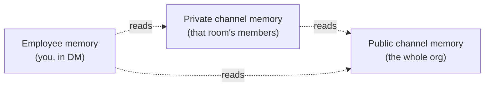

# The permissions graph

What Company Brain remembers, who it's visible to, and how tool access is scoped.

Company Brain isn't split into "a shared brain" and "a private brain." It's a graph: memory is written to the narrowest room a conversation happened in, and what a given conversation can *read* depends on where it's happening and who's asking. Nothing here is silent: every install, channel rollout, and temporary access grant requires an explicit accept from a real person.

## Three memories, not two

- **Employee memory:** one per person. Built from your DMs with the bot and what it learns about you over time. Only visible from your own DM.
- **Private channel memory:** one per private channel. Scoped to that room: visible to anyone in it, to no one outside it.
- **Public channel memory:** one per organization. Anything durable from a public channel lands here. The whole org can draw on it.

A message writes to exactly one of these, whichever room it happened in.

Under the hood these are supermemory container tags in the account your deployment's API key belongs to: `sm_org_shared` for public channel memory, `slack_channel_<channel id>` for each private channel, and `user_<user id>` for each person.

## What a conversation can read

Writing is narrow; reading is broader, and it widens the more private the room is:

| Asking from | Can read |
|---|---|
| A public channel | Public channel memory |
| A private channel | That channel's memory + public channel memory |
| A DM with the bot | Your employee memory + public channel memory + every private channel memory you belong to |

A DM is the widest seat in the room precisely because it's the most private one: the bot answers you there with everything *you* could see, stitched together. A public channel is the opposite: the whole org can read it, so it only ever draws on what the whole org is allowed to know.

> [!NOTE]
> If you're not in a private channel, its memory doesn't exist for you, not even by inference in a DM. The bot only ever reads with the asker's own access, so it can't surface something you couldn't otherwise see.

**Example:** you DM the bot asking "what did we decide about the Acme deal?" It can draw on the public `#sales` channel, the private `#acme-deal` channel if you're in it, and anything it's learned about you directly, and it'll cite which one the answer came from. Ask the same question in `#general`, a public channel, and it can only answer from what `#general` and other public channels already know. The private `#acme-deal` context simply isn't in scope there.

The **Graph** page in the app follows the same idea: it shows public channel memory plus your own employee memory, never a teammate's.

## Tool access follows you, not the connection

Tools like GitHub and Linear can be connected two ways: **Organization (shared)**, set up once by an admin as a fallback the whole team can read from, or **Personal (yours)**, your own connection for your own reads and actions. Both show up on the same Integrations page (Configure → Integrations); it's one tool catalog, connected at two possible scopes.

Whichever scope answered, the result is still bounded by what that connection can see in the tool. Company Brain never gets a standing key to "everything Linear knows" beyond what the connected account has.

| | Reads | Writes |
|---|---|---|
| **Behavior** | Use your personal connection when you have one, otherwise the org-shared one | Only through your own personal connection |
| **Why** | Gives you the fullest access you're entitled to | Attributes the action to a real person, never a shared service account |

Org-shared connections are **read-only for everyone**, admins included. If you ask for a write (create an issue, comment on a PR) and only the org has that tool connected, the bot tells you to connect it personally.

## Leasing: borrowing access for one request

Sometimes a request needs a tool neither you nor the org has connected, but a teammate has it connected personally. Rather than failing, Company Brain can ask that teammate directly: it posts a card in Slack asking them to approve or deny lending access for that one request.

- Nothing is granted silently: a real person has to accept the card.
- Access is short-lived and scoped to the request that triggered it: a grant lasts 10 minutes, and an unanswered request expires after 15.
- The teammate can say no, and the request simply doesn't go through.
- Some tools can't be leased at all. Gmail, for one, is personal-only.

> [!NOTE]
> Leasing is a fallback of last resort. It only comes up when nobody's connected the tool at the org level yet. See [Connectors](connectors.md) to close that gap for good.

## Who can change what

- The **owner** is the first person who signed in. Owners and **admins** can install to Slack, add org-shared tool connections and org-wide skills, change org-wide settings (models, workspace prompt, proactivity), create automations that post to private channels, and manage everyone's automations.
- **Members** sign in with Slack, connect their own tools, write personal skills, and manage their own automations.

> [!NOTE]
> This build has no screen for promoting someone to admin yet. Roles live in the `member` table of your D1 database (`owner`, `admin` or `member`).

Next:

- **[Connectors](connectors.md):** set up the data and tool connections this page describes.
- **[Automations and proactiveness](automations.md):** how scheduled runs and unprompted replies respect the same graph.
